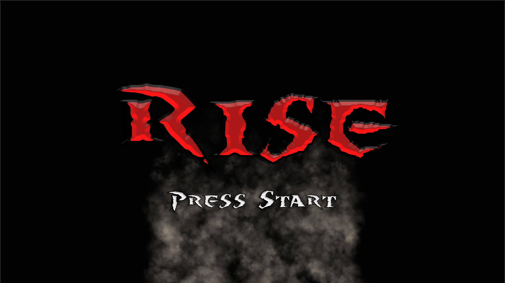
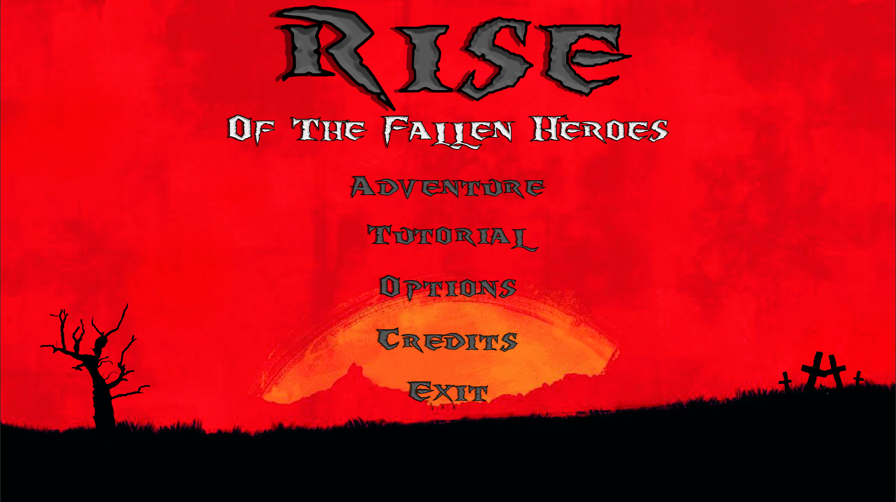
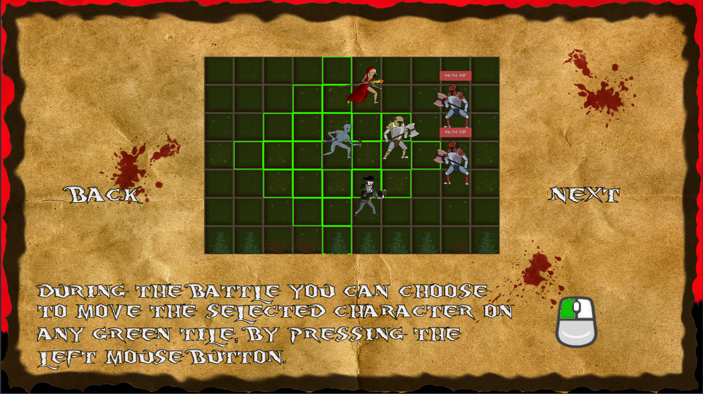
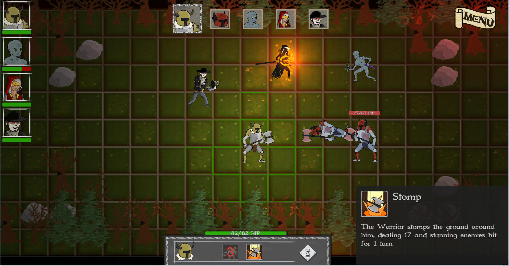
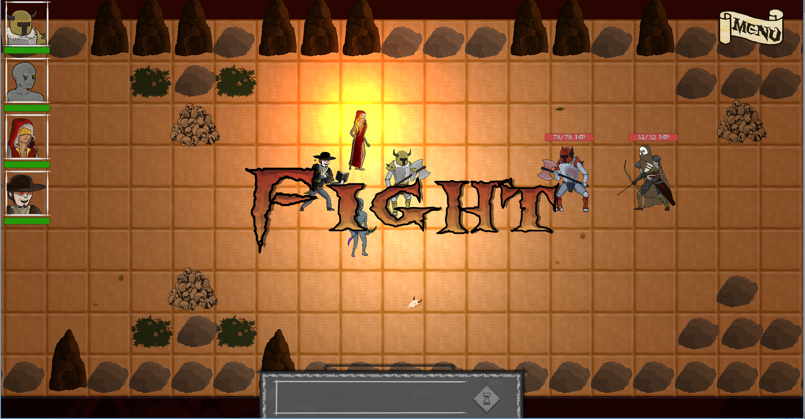
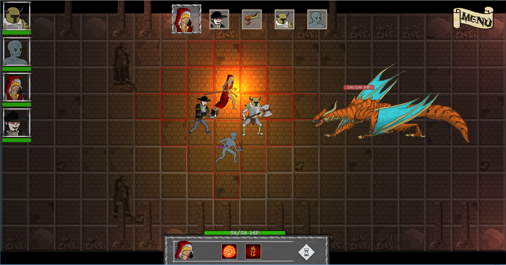

# Rise of the fallen heroes
Rise of the fallen heroes è il terzo progetto realizzato nella Digital Bros Game Academy ed il primo sviluppato con l'engine Unity.
È un RPG a turni a caselle in cui un gruppo di eroi maledetti deve affrontare il male supremo e redimersi, portando ordine in un mondo ormai distrutto.
Il sistema di movimento è diviso in due parti: la prima riguarda il movimento libero (quando non si è impegnati in un combattimento) durante il quale i personaggi si dispongono in coda e si muovono insieme nella casella selezionata dal mouse! La seconda riguarda il movimento in combattimento in cui ogni personaggio ha due turni in cui può decidere se spostarsi sulle caselle raggiungibili o attaccare con un attacco fisico o con una abilità!
Inoltre ogni personaggio ha attributi che lo caratterizzano; alla fine di ogni livello ci sarà la possibilità di incrementare tali attributi che vanno ad influenzare la forza, la destrezza e la salute di ogni personaggio!
In questo progetto ho lavorato in team con un altro programmatore e mi sono occupato maggiormente delle seguenti features:
- Gestione delle varie abilità dei personaggi
- Gestione dell'illuminazione delle caselle nel movimento, nel combattimento e nell'utilizzo delle abilità sia dei personaggi principali che dei nemici
- Implementazione di parte del movimento
- Implementazione di parte dell'HUD (abilità e tooltip delle varie abilità)

